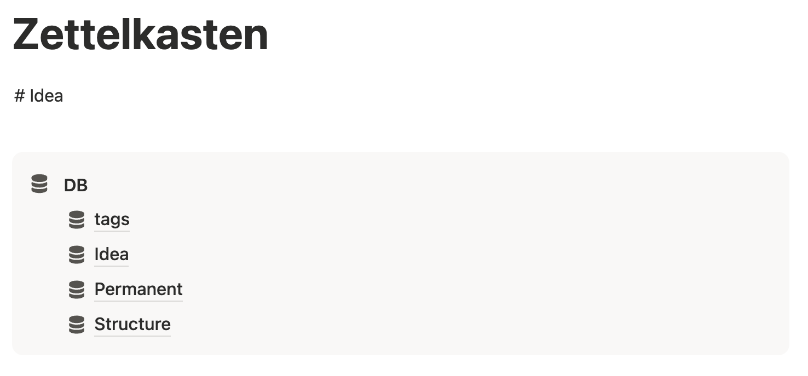
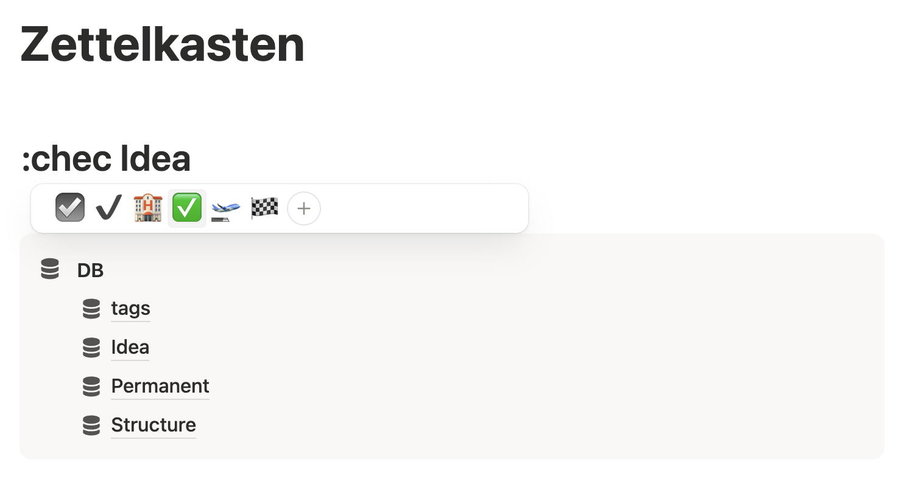
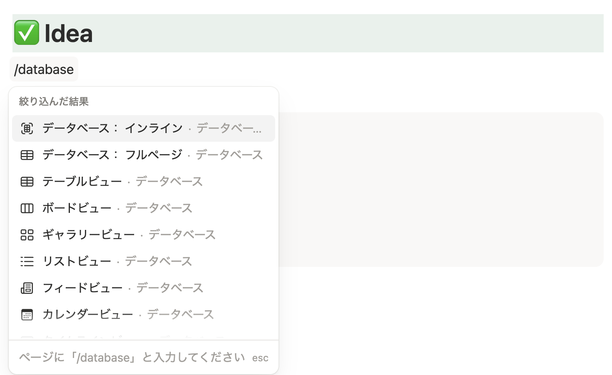
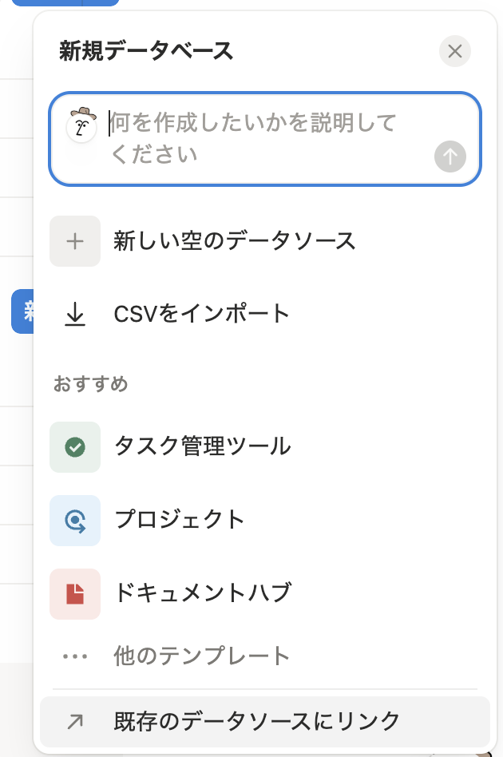
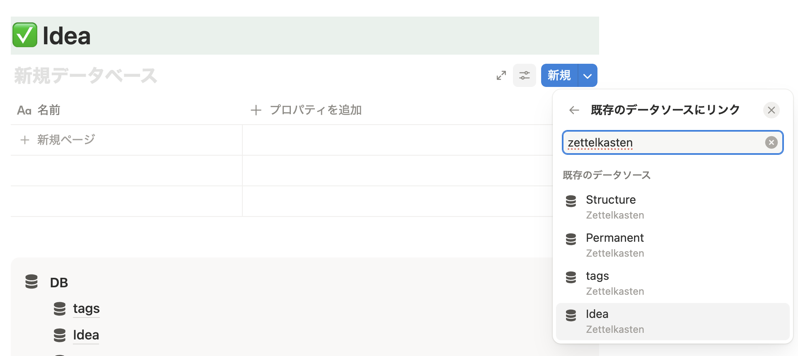
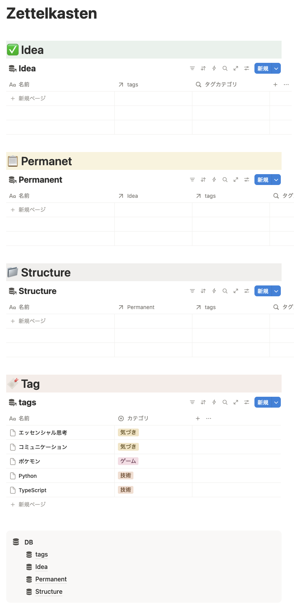

# はじめに

エンジニアには、QiitaやZennのように技術的な内容を記事としてまとめ、公開する文化があります。  
エンジニアでなくとも、noteのように日々の気づきや本質的な内容を記事として公開し、お金に換えていける時代となりました。  
そんな記事を書いてインターネットに公開することがアドバンテージとなる時代、どのように記事を作成していけばいいのでしょうか。

本書では日々小さく思いつくアイディアの源泉を溜め、膨らませるためのメモ管理術について掘り下げていきます。  
そのメモ管理術がZettelkasten（ツェッテルカステン）です。  
知識管理の手法で、小さなメモ（これはNoteと表現されます）をたくさん作成。それらを紐付け、まとめ、大きな文献を作成していく手法になります。  
もともとはニコラス・ルーマンという社会学者が使っていた知的生産の手法でした。この人はZettelkastenを構築しており、約50冊の本と約550の寄稿を執筆したとされています。(wikipedia参照)

2025年、生成AIの発展につれてObsidian、Notionが注目されるにあたり、Zettelkastenにもスポットライトがあたりました。  
第二の脳として機能するだけでなく、文章として残るため生成AIのコンテキストとしても機能するためです。

今回はそんなZettelkastenをNotionでシステム構築する手法を紹介します。

## Zettelkastenについて

Noteは下記表のようにレベルを分け、Noteを相互リンクさせます。  
各Noteにはタグなどのメタ情報を付与し管理しやすくします。

| レベル | 説明 |
| --- | --- |
| アイディアノート | 思いつきのメモや記事をスクラップするノートです。 他インターネット記事では思いつきのメモを一時メモ、記事のスクラップを文献メモで分けられています。 私は分けない方が使いやすかったためアイディアノートとしてまとめています。 |
| パーマネントノート | アイディアノートをまとめて文書化をここで行います。 記事の「章」に当たるものとして、アイディアをまとめます。 |
| ストラクチャーノート | パーマネントノートをまとめて文書化します。 これが記事の内容となります。 |

## notionについて

クロスプラットフォームな高機能ドキュメントツールです。  
基本的には無料で使えますが、AIを使ったり他のアカウントとコラボレーションしたりするには有償プランの契約が必要となります。  
今回は無料で行える機能を用いてZettelkastenの構築が可能です。

「ページ」と「ブロック」という単位で管理され、ページはブロックの集合体となります。  
「ページ」はその通りページであり、ブロックというのは各文やテーブル、メディアといったコンテンツ一つ一つになります。  
Notionはマークダウンにある基本機能にとどまらず、データベースを作成しそこからチャートを作成したり、簡単なオートメーションを組んで操作の自動化をしたりもできます。  
本書ではNotionのデータベース機能を用いてシステムを構築します。

# 作り方

## データベースを構築する

Notionのデータベース(以降DB)は、DBそのものもDBのレコードもページとして作成されます。  
DBは各ノート層+これらにつけるタグを入れるDBの、4つDBを作成します。  
DBはいずれも「データベース: フルページ」で作成します。

### コールアウト

Notionはページ内にページを作成して階層化します。  
今回はDBを4つDBを作成する必要があるため、ページを作成しまとめる箇所を最初に作っておくとページが綺麗になります。  
「コールアウト」を用いてDBのページをまとめておく部分をページ上に作成しましょう。  
`/callout` でコールアウトブロックを作成できます。

コールアウトブロックには絵文字が設定できます。  
せっかくなので設定してみましょう。  
コールアウトブロック右側の絵文字部分をクリックし、「アイコン」タブで `database` を入力。それっぽいアイコンを見つけたら色を選択して設定できます。

コールアウトブロックの一番上に「DB」と入力して、太字にすることでそれっぽくできます。  
コールアウトブロック内に、見出しブロックを配置したり、コールアウトブロックを配置したりもできます。

### Tag DB

まずはメタ情報となるタグを格納するDBを作成します。  
`/database` でデータベースブロックを作成できます。  
DBは「データベース: フルページ」で作成します。

作成直後は下記キャプチャのようになります。

なくてもOKですが、タグもカテゴライズした方が便利なのでtags DBにプロパティを追加します。  
DBヘッダーの「＋」をクリックし、「種類を選択」で「選択」を選択します。

プロパティ名を「カテゴリ」とします。

タグカテゴリプロパティを作成します。  
フォームに作成したいタグカテゴリ名を入力し、エンターを押すことで新規にタグカテゴリが作成されます。

レコードを追加するには、右上の「新規」または、DB末尾の「新規ページ」をクリックすることで新規レコードが追加できます。

### Idea Note DB

アイディアノートを格納するDBを作ります。  
Tag DBで行ったのと同様に、DBを作成しましょう。  
「データベース: フルページ」で作成します。

Idea DBにプロパティを追加します。  
本書ではシンプルにTag DBとのリレーションのみを追加します。

1. リレーションプロパティの追加を選択

2. リレーション対象に、先ほど作成したTag DBを選択

3. 「リレーションを追加する」をクリック

Tag DBにはタグカテゴリも用意しているため、ロールアップ機能を用いてリレーションを貼ったタグのカテゴリもプロパティとして持たせます。

1. ロールアッププロパティの追加を選択

2. 「プロパティを編集」 > 「リレーション」 > 「tags」を選択

3. 「ターゲットプロパティ」に「カテゴリ」を選択

4. プロパティ名を「タグカテゴリに変更」

下記キャプチャのようになっていれば成功です。

### Permanent Note DB

パーマネントノートを格納するDBを作ります。  
やり方はここまでで記載しているため、手順のみ記載します。

1. 「データベース: フルページ」で「Permanent」DBを作成
2. データベースのプロパティを下記の通りに追加

| プロパティ名 | 種別 | DB先/プロパティ |
| --- | --- | --- |
| idea | リレーション | idea DB |
| tags | リレーション | tag DB |
| タグカテゴリ | ロールアップ | tag DB / カテゴリ |

下記キャプチャのようになっていれば成功です。

### Structure Note DB

ストラクチャーノートを格納するDBを作ります。

1. 「データベース: フルページ」で「Structure」DBを作成
2. データベースのプロパティを下記の通りに追加

| プロパティ名 | 種別 | DB先/プロパティ |
| --- | --- | --- |
| permanent | リレーション | permanent DB |
| tags | リレーション | tag DB |
| タグカテゴリ | ロールアップ | tag DB / カテゴリ |

下記キャプチャのようになっていれば成功です。

## インラインDBを表示させる

DBへのレコード追加を使いやすくするため、このZettelkastenを使うハードルを下げるため、データベースを構築したトップページ配下にインラインでDBを表示させます。

### 区切りのための見出し

まずは区切りをわかりやすくするため、見出しを用意します。  
`# ` で「見出し1」ブロックを作成できます。  
`#` の数で見出しNを指定できます。  
Notionでは、見出しは1〜3まで作成できます。

ここで見出しを用いた区切りを行う際に、より区切りをわかりやすくするためのテクニックを紹介します。  
「絵文字」 + 「背景色」を用います。

`:` + `{絵文字名}` で絵文字を表示できます。また、 `/emoji` で絵文字をUI上から選択することができます。

ブロック横のメニューアイコンをクリック → 「カラー」を選択することで、文字色や背景色を設定することができます。

### インラインDBの表示

続いて、インラインDBを表示させます。  
`/database` で「データベース: インライン」を選択します。

作成するとDBを新規に作成するか、既存のものを用いるか訊かれます。
「既存のデータベースにリンク」を選択し、対象のデータベースを選択します。  

ここでは「Idea」のDBを表示させたいので、「Idea DB」を選択します。

このやり方で、下記順にページを拡充させましょう。  
私の選択したページの絵文字と色を下記にまとめます。

| DB | 絵文字 | 背景色 |
| --- | --- | --- |
| Idea | check | 緑 |
| Permanent | clipboard | 黄色 |
| Structure | folder | グレー |
| Tag | bookmark | ブラウン |

下記のようになっていれば成功です。

# おわりに

以上、ZettelkastenをNotionで構築する手法でした。

メモ管理術やツール、利用していくAIには人によって合う合わないがあります。  
今回はNotionで構築したため、Notion AIと相性が良いですが、別のAIツールを用いるために冒頭に記載したObsidianを用いるのも手でしょう。  
また、今回記載したZettelkastenを自分なりにカスタマイズしていく、もしくはZettelkastenを使わないというのも良いと考えます。  
今回の目的はアウトプットを出すことなので、過程は十人十色です。私にとってその「過程」を支えるツールがNotionであり、手法が「Zettelkasten」でした。  
ここまで書いておいてですが、インターネットで検索をかければ構築方法が様々公開されていますし、Youtubeで検索をかければ動画で構築する手法がたくさん転がっています。  
試行錯誤して自分に合った過程を支えるやり方を見つけていただけたらと思います。  
本書はその試行錯誤の一案として役に立っていただけたら冥利につきます。  
以上、拙い文章ですが、ここまで読んでいただきありがとうございました。
